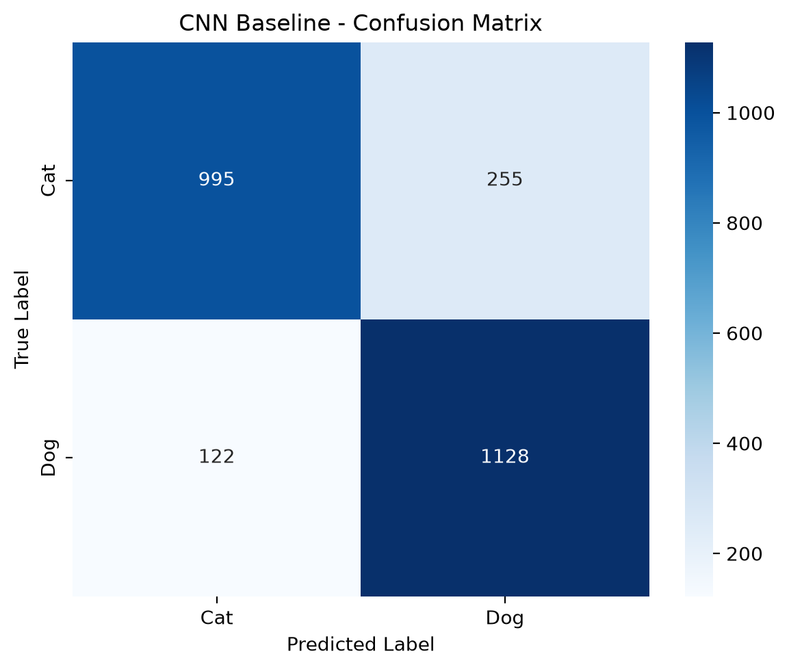
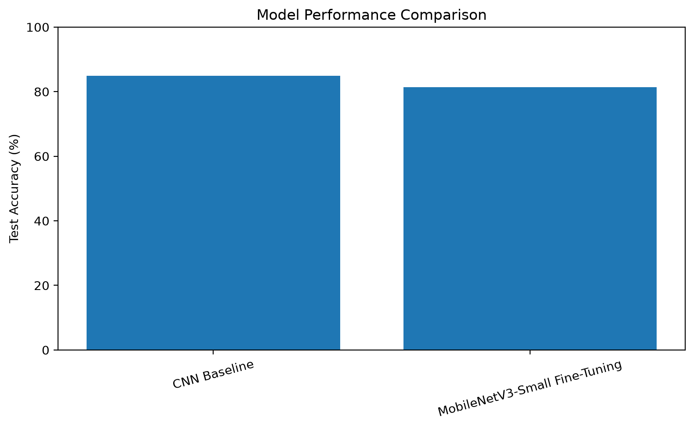

# Cats vs Dogs Image Classification

A deep learning project for binary image classification using PyTorch.

The goal of this project is to build a Convolutional Neural Network (CNN) capable of classifying images as either cats or dogs.

---

## Project Overview

This project demonstrates an end-to-end deep learning workflow for image classification.

The main steps include:

- Dataset validation and corrupted image detection
- Train, validation, and test splitting
- Custom PyTorch Dataset
- Data augmentation
- CNN architecture design
- Model training and checkpointing
- Model evaluation
- Confusion matrix analysis
- Error analysis
- Transfer learning
- Fine-tuning
- Single-image inference

---

## Dataset

The project uses the Microsoft Cats and Dogs Dataset.

After validation:

| Category | Count |
|---|---:|
| Valid images | 24,998 |
| Invalid images | 4 |
| Cats | 12,499 |
| Dogs | 12,499 |

The dataset was split into:

- 80% Training
- 10% Validation
- 10% Test

The original dataset is not included in this repository.

---

## Data Preprocessing

All images were converted to RGB and resized to:

```text
128 × 128 × 3
```

Training images were augmented using:

- Random Horizontal Flip
- Random Rotation

Validation and test images were only resized and converted to tensors.

---

## CNN Model

The main model is a custom Convolutional Neural Network implemented with PyTorch.

### Architecture

```text
Input
  ↓
Conv2D (3 → 32)
  ↓
ReLU
  ↓
MaxPool
  ↓
Conv2D (32 → 64)
  ↓
ReLU
  ↓
MaxPool
  ↓
Conv2D (64 → 128)
  ↓
ReLU
  ↓
MaxPool
  ↓
Flatten
  ↓
Linear (128)
  ↓
ReLU
  ↓
Linear (2)
  ↓
Cat / Dog
```

---

## Results

The final CNN achieved:

| Metric | Result |
|---|---:|
| Test Accuracy | **84.92%** |
| Test Loss | **0.3420** |
| Test Samples | 2,500 |
| Correct Predictions | 2,123 |
| Incorrect Predictions | 377 |

### Confusion Matrix

The confusion matrix below shows the model's predictions on the test set.



### Model Comparison

The project also explored transfer learning using MobileNetV3-Small.



---

## Error Analysis

Misclassified images were inspected to understand the main sources of error.

Common patterns included:

- Blurry or low-quality images
- Unusual poses or viewing angles
- Small subjects within the image
- Complex or cluttered backgrounds
- Visually ambiguous examples

These observations show that image quality, object scale, background complexity, and visual similarity can affect classification performance.

---

## Transfer Learning

MobileNetV3-Small pretrained on ImageNet was also investigated as a transfer learning approach.

Two strategies were explored.

### Feature Extraction

The pretrained feature extractor was frozen and a new classification layer was trained.

### Fine-Tuning

The final feature blocks were unfrozen and trained with a smaller learning rate.

The fine-tuned MobileNetV3-Small achieved a test accuracy of **81.40%** in the experiment.

In this project, the custom CNN achieved higher test accuracy than the fine-tuned MobileNet model.

This experiment demonstrates that transfer learning is not automatically superior for every dataset and problem.

---

## Single Image Prediction

The project includes a reusable prediction pipeline for classifying individual images.

Example:

```python
predict_image("path/to/image.jpg")
```

Example output:

```text
Prediction: Dog
Confidence: 94.31%
```

---

## Project Structure

```text
Cats vs Dogs/
│
├── data/
├── models/
│
├── notebooks/
│   └── 01_image_classification_final.ipynb
│
├── results/
│   ├── confusion_matrix.png
│   ├── model_comparison.png
│   └── results_summary.txt
│
├── src/
│   ├── model.py
│   └── predict.py
│
├── .gitignore
├── requirements.txt
└── README.md
```

---

## Technologies

- Python
- PyTorch
- Torchvision
- Scikit-learn
- Pandas
- NumPy
- Matplotlib
- Seaborn
- Pillow
- Jupyter Notebook

---

## Key Learning Outcomes

Through this project, I practiced:

- Building CNNs with PyTorch
- Working with RGB image datasets
- Creating custom PyTorch Datasets
- Using DataLoaders
- Applying image augmentation
- Training and validating deep learning models
- Saving and loading model checkpoints
- Evaluating classification models
- Using confusion matrices
- Performing error analysis
- Applying transfer learning
- Fine-tuning pretrained models
- Building a reusable image prediction pipeline

---

## Author

**mstf-dev**

Aspiring Data Analyst | Machine Learning | Data Analysis